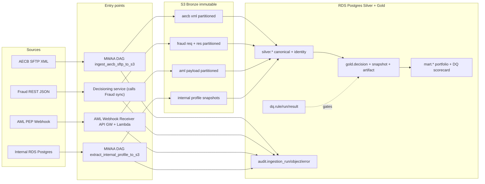
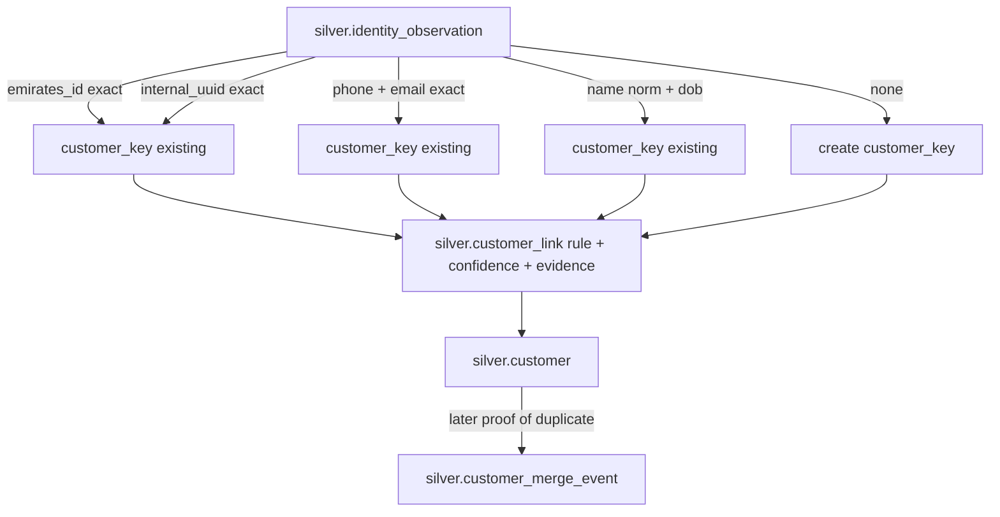
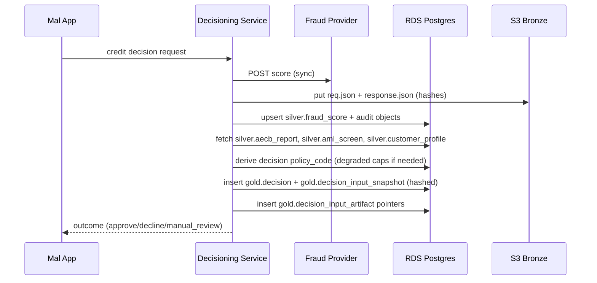
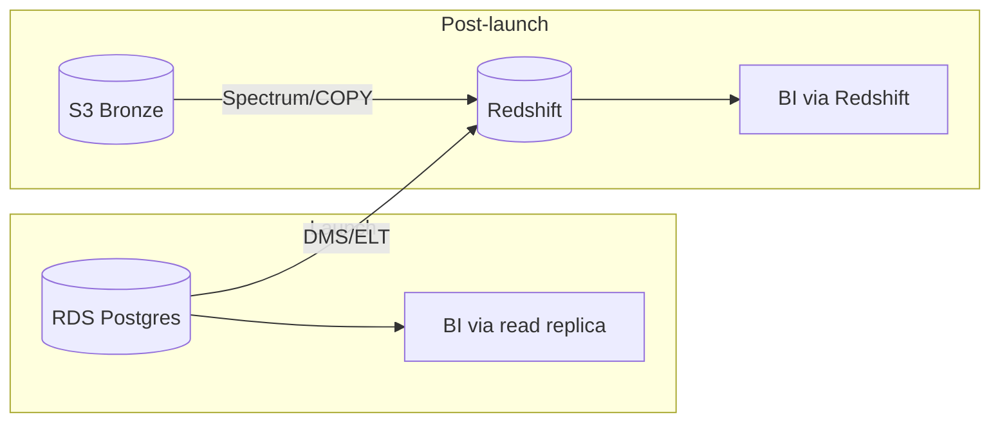

# Unified Decision-Input Pipeline — System architecture specification

**Document type:** Architecture document (canonical technical specification for this repository)  
**Author:** Data Engineering  
**Target:** Mal.ai Q2 2025 launch of 3 credit products (Personal Finance, BNPL, Card Alternative)  
**Compliance:** UAE Central Bank audit + Sharia-compliant product structures  
**Scale:** 10K decisions/day at launch → 100K/day within 12 months  

**See also:** Design dimensions → evidence: [`design_criteria_map.md`](design_criteria_map.md). Topical index of all docs: [`README.md`](README.md).

---

## 1. Problem and requirements

Mal is launching three credit products simultaneously. Each credit decision must be made using four independent external/internal data sources that disagree on identifiers, delivery mechanisms, and freshness:

| Source | Transport | Format | Customer key | Cadence |
|---|---|---|---|---|
| **AECB** (UAE Credit Bureau) | SFTP | XML | Emirates ID | Batch (daily/intraday) |
| **Fraud provider** | REST API | JSON | phone + email | **Real-time (sync)** |
| **AML/PEP screening** | Webhook callback | JSON | name + DOB | Event-driven |
| **Internal customer profile** | PostgreSQL | rows | internal UUID | Continuously updated |

Requirements the pipeline must satisfy:

- **Medallion architecture** (Bronze / Silver / Gold) on AWS.
- **Conflict resolution** to produce a single `customer_key` per real person.
- **Decision traceability** — immutable snapshot of *all* inputs per decision, reconstructable years later.
- **Data Quality scorecard** with must-pass rules + thresholds + alerting.
- **Portfolio monitoring mart** for the risk team.
- **30/60/90 execution plan** separating launch-critical vs post-launch work.
- **UAE Central Bank audit trail**, retention, and controls.
- **Sharia compliance** (no riba; profit-based structures; charity-routed late fees).

---

## 2. End-to-end architecture



**Key invariants**

- Raw bytes land in **S3 Bronze** *before* any processing; every byte is **hashed and audited**.
- **Silver** is the single conformed view, keyed by the resolved `customer_key`.
- **Gold decision snapshots** are **append-only** with a canonical hash and artifact pointers back to Bronze.
- **DQ gates** can **block Gold publishing or decisioning**; results are stored and alerted on.

---

## 3. Bronze: raw immutable landing (S3)

### 3.1 Key conventions

```
bronze/aecb/ingest_date=YYYY-MM-DD/batch_id=<bureau_batch_id>/<filename>.xml
bronze/fraud/req/decision_date=YYYY-MM-DD/decision_id=<id>/request.json
bronze/fraud/res/decision_date=YYYY-MM-DD/decision_id=<id>/response.json
bronze/aml/ingest_date=YYYY-MM-DD/event_id=<vendor_event_id>/payload.json
bronze/internal_profile/snapshot_date=YYYY-MM-DD/export.csv
bronze/_manifests/source=<source>/run_id=<run_id>/manifest.json
```

### 3.2 Properties

- **S3 versioning** and **Object Lock (governance or compliance mode)** enabled for legal hold.
- **KMS encryption** with a dedicated key per environment.
- **SHA-256** computed for every object and stored alongside in `audit.ingestion_object.sha256_hex`.
- **Idempotency**: the S3 key itself contains natural keys (`decision_id`, `event_id`, `batch_id`) so retries overwrite the same key (same bytes → same hash; any drift is detected).

### 3.3 Entry-point mapping

| Source | Owner (entry point) | Why |
|---|---|---|
| AECB | **MWAA DAG** | Batch SFTP fits Airflow's retry/backfill semantics. |
| Fraud | **Decisioning service** | Real-time scoring; write-through at decision time preserves latency. |
| AML | **Webhook receiver (API GW + Lambda or ECS)** | 24x7 HTTP endpoint; Airflow is not a listener. |
| Internal | **MWAA DAG** | Scheduled logical snapshot now; CDC (DMS) post-launch. |

---

## 4. Silver: conformed entities and identity

### 4.1 Canonical tables (`silver.*`)

- `silver.aecb_report(emirates_id, bureau_batch_id, bureau_score, delinquency_flags, raw_object_id, ...)`
- `silver.fraud_score(decision_id, phone_e164, email_norm, score, risk_band, reason_codes, raw_req_object_id, raw_res_object_id, ...)`
- `silver.aml_screen(aml_event_id, full_name, dob, screening_ts, status, match_details, raw_object_id, ...)`
- `silver.customer_profile(internal_uuid, full_name, dob, phone_e164, email_norm, emirates_id, kyc_status, ...)`

Each canonical table links back to `audit.ingestion_object.object_id` so we can trace every Silver row to exact Bronze bytes.

### 4.2 Identity resolution (deterministic-first, layered confidence)



**Rule precedence & confidence (launch)**

| Rule | Confidence | Notes |
|---|---|---|
| `emirates_id_exact` | 1.00 | Government-issued; strongest. |
| `internal_uuid_exact` | 1.00 | Internal system-of-record. |
| `phone_email_exact` | 0.85 | Medium; mutable, may be shared. |
| `name_dob_exact_norm` | 0.65 | Weakest; collisions common. |

**Design choices**

- `silver.identity_observation` is the unifying record: each source contributes observations, and the resolver maps them to a stable `customer_key`.
- All links are stored with **rule, confidence, and evidence JSON**, enabling later audit of "why did we link these?".
- **Merges** are append-only events (never rewriting history) — this preserves the decision snapshots that already used an earlier key.

**Failure-mode mitigations**

- False merges → require two independent strong signals for any merge; keep manual-review queue for borderline cases post-launch.
- Missed links → periodic re-resolution passes; backfill jobs can revisit older observations when a strong key appears later.

---

## 5. Gold: decision traceability (immutable snapshots)

### 5.1 Tables

- `gold.decision` — product, requested amount, policy code, customer_key, outcome.
- `gold.decision_input_snapshot` — **immutable** JSON of all inputs used (+ DQ status + model/rule version) keyed by UUID, with `sha256_hex` over canonical JSON.
- `gold.decision_input_artifact` — per-source pointers to Bronze (`s3_bucket`, `s3_key`, `sha256_hex`).

### 5.2 Snapshot construction (sequence)



### 5.3 Replay & verification

`mal_pipeline.decision.replay.replay_snapshot()` reconstructs the canonical JSON payload, recomputes the SHA-256, and re-fetches every Bronze artifact to verify its hash is unchanged. This is the **primary auditor-facing proof of immutability**.

---

## 6. Data Quality scorecard

- Rules declared in `python/mal_pipeline/dq/rules.yml` with `severity = MUST_PASS | WARN`.
- Runner writes `dq.run` and per-rule `dq.result` rows with `violation_count` and `sample_violations`.
- MWAA gate: if any `MUST_PASS` rule fails in-scope, downstream publishing to Gold or mart is **skipped**; alerts fire via CloudWatch → SNS → Slack/PagerDuty.
- Mart `mart.dq_scorecard_daily` summarizes must-pass vs warn failures per layer per day.

**Launch must-pass examples**

- AECB Emirates ID format valid.
- Fraud response has a non-null `provider_response_ts` and `score` present.
- Every `gold.decision_input_snapshot` references an existing `gold.decision`.

---

## 7. Portfolio monitoring mart

- `mart.risk_portfolio_daily` — decisions, approvals, declines, degraded counts, avg requested amount, DQ must-pass failures — by product per day.
- `mart.customer_risk_features_latest` — latest bureau/fraud/AML outcome per customer for feature serving.
- `mart.dq_scorecard_daily` — rollup for dashboards + SLA.

Marts are intentionally narrow and **incremental by `as_of_date`**, so the same builder can be ported to Redshift later with no logic changes.

---

## 8. Sharia compliance data model

Islamic finance cannot recognize riba (interest). We model product structure explicitly:

- `gold.product(product_id, product_type, sharia_contract, profit_rate_bps, late_fee_treatment, charity_account_ref, shariah_board_approval_ref, ...)`
- `gold.decision` carries `product_id`, `sharia_contract`, `profit_rate_bps`, `disclosures_version`.

**Operational implications**

- Late fees default to `charity` routing; the data model captures the treasury account reference so reporting can prove no riba flows into P&L.
- Every product version is tied to a Shariah Board approval reference for audit.
- Any decision row can be evaluated for Sharia policy adherence by joining to the product catalog.

---

## 9. Degraded decisioning policy (BNPL in particular)

When AECB is delayed:

- **Personal Finance & Card Alternative**: **hard-block** (policy_code = `required_bureau`).
- **BNPL**: allow `degraded_no_bureau` only if all of the following hold:
  - `requested_amount ≤ per_decision_max_aed`
  - `count_used + 1 ≤ daily_count_cap`
  - `exposure_used + requested_amount ≤ daily_exposure_cap_aed`
  - AML present and clear; fraud present and within threshold.

After AECB eventually arrives, a **reconciliation DAG** writes `gold.decision_reassessment` rows with a new snapshot and an outcome (`reaffirmed | limit_reduced | blocked | escalated`).

---

## 10. Security, compliance, retention

- **Encryption**: S3 KMS CMKs; TLS in transit; Postgres at rest via RDS KMS; column-level encryption for PII where justified.
- **IAM**: Least-privilege roles per component; separate read vs write paths; no human direct access to Bronze payloads in prod.
- **PII strategy**: PII in Silver is separable (dedicated schema/role) so deletion requests can anonymize PII while preserving decision-snapshot evidence (which may reference hashed pointers only).
- **Retention**: 7+ years for decision artifacts (Central Bank norm); lifecycle rules transition older Bronze to S3 Glacier Deep Archive.
- **Legal hold**: S3 Object Lock when matters arise; Postgres row-level immutability enforced by schema (no UPDATE on snapshots; app-layer forbids; optional trigger).

---

## 11. Orchestration (MWAA)

- `ingest_aecb_sftp_to_s3` (schedule, retries, idempotent on S3 key).
- `extract_internal_profile_to_s3` (schedule).
- `bronze_to_silver_{source}` (sensor on new audit.ingestion_object rows).
- `identity_resolution` (window over new observations).
- `run_dq_and_publish_gold` (**must-pass gate**).
- `build_marts` (post-gate).
- `aml_webhook_reconcile` (micro-batch; Bronze → `silver.aml_screen`).
- `aecb_post_arrival_reassessment` (triggers `gold.decision_reassessment` flow).

DAGs are small and single-purpose; state lives in Postgres so the same artifacts are re-usable across reruns/backfills.

---

## 12. Scaling plan (10K → 100K decisions/day)

- **Postgres (launch)**: partition `gold.decision`, `gold.decision_input_snapshot`, `audit.ingestion_object` by month; PITR on; read replica for mart queries.
- **Write paths**: connection pooling (PgBouncer); statement timeouts; batched upserts for Silver where possible.
- **Bronze**: S3 prefix sharding is naturally wide (decision_id); no hotspotting.
- **Redshift migration (post-launch)**: ELT from Postgres and S3 into Redshift for marts; leave Gold immutable snapshots in Postgres as system-of-record; use COPY + manifest patterns to keep parity.
- **Observability**: CloudWatch metrics on DAG durations, DQ failure counts, snapshot-write latency, fraud-API tail latencies.



---

## 13. Trade-offs (quick reference; full analysis in `tradeoffs_production_readiness.md`)

- **Postgres first vs lakehouse**: fastest time to launch; accepts rework cost for BI scale — mitigated by keeping schemas Redshift-portable.
- **Deterministic-only identity at launch**: lower false-merge risk; worse recall for ambiguous cases — mitigated by manual review queue + periodic re-resolution.
- **Write-through fraud persistence**: couples Bronze write to decision latency — mitigated by pre-call write (we preserve inputs even if provider fails) and <100ms S3 write latencies.
- **Webhook at the edge**: keeps receiver minimal; pushes normalization to MWAA — mitigated by idempotent reconcile keyed on `aml_event_id`.

---

## 14. Deferred scope (initial release vs roadmap)

Out of scope for the **initial reference implementation** in this repo (planned next in `execution_plan_30_60_90.md`):

- Probabilistic identity matching; blocking indexes.
- Full CDC for internal profile (we use daily snapshot).
- Full Redshift stack (we describe the migration path).
- Deep Sharia product modeling (we capture structure, not every fee/fatwa edge case).
- Fine-grained per-role PII tokenization.

These are the **first post-launch items**, sequenced in `execution_plan_30_60_90.md`.
