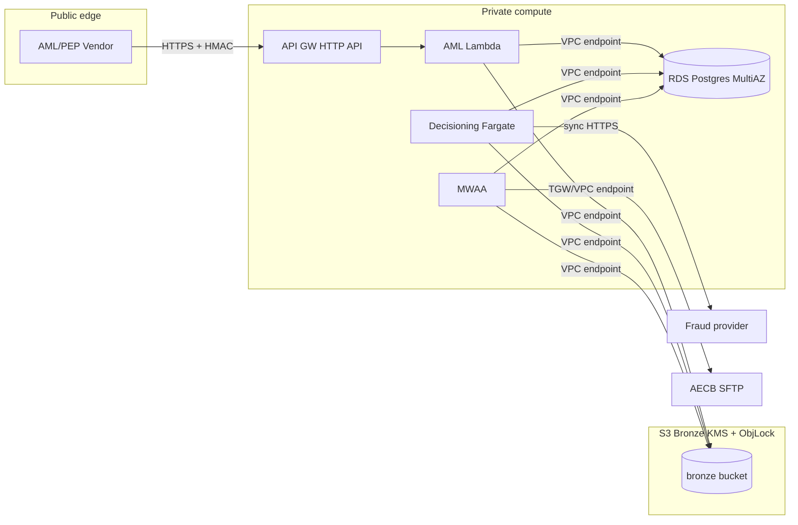

# AWS Infrastructure Schema

This doc describes the AWS topology that hosts the unified decision-input pipeline. It complements `architecture.md` (which is technology-agnostic) with concrete AWS choices, account/VPC layout, IAM boundaries, and security controls.

---

## 1. Account & environment topology

We recommend a **multi-account** setup via AWS Organizations + Control Tower:

| Account | Purpose | Who has write access |
|---|---|---|
| `mal-prod` | Production pipeline (data + apps) | CI/CD role + break-glass only |
| `mal-preprod` | Pre-prod / UAT | Team engineers + CI/CD |
| `mal-dev` | Dev & sandbox | Engineers |
| `mal-audit/log-archive` | Central logs, CloudTrail, config | Immutable (SCP + Object Lock) |
| `mal-security` | GuardDuty / Security Hub / IAM Access Analyzer | Security team |

Per-account guardrails:

- **SCPs** deny regions outside ME-Central/South-Asia (unless explicitly allowed).
- **SCPs** deny disabling CloudTrail, GuardDuty, or key rotation.
- **CloudTrail** (org trail) writes to `mal-audit/log-archive` with **S3 Object Lock** (compliance retention ≥ 7 years).
- **AWS Config** records all resources; `required_tags` (`env`, `owner`, `data_classification`) are enforced.

---

## 2. Network (VPC) layout per account

```
mal-prod VPC (10.10.0.0/16)
├── Public subnets (3 AZs)           -> NAT Gateway, ALB for AML receiver
├── Private app subnets (3 AZs)      -> MWAA, ECS (if used), AML receiver backends
├── Private data subnets (3 AZs)     -> RDS Postgres, ElastiCache (optional)
├── VPC endpoints (Interface/Gateway):
│     - com.amazonaws.*.s3   (Gateway)
│     - com.amazonaws.*.kms / secretsmanager / sts / logs / ssm (Interface)
│     - Optional: com.amazonaws.*.sftp (if using Transfer Family)
└── Transit Gateway attachment (cross-account shared services / on-prem SFTP if applicable)
```

Key rules:

- No public IPs on app/data subnets.
- All AWS API traffic goes through **VPC Interface Endpoints** so it stays on the AWS backbone (prevents IAM exfiltration via public internet).
- Security Groups are identity-based (reference each other), no 0.0.0.0/0 on private tiers.
- **AWS Shield Standard** + **WAF** on ALB fronting the AML webhook receiver.

---

## 3. Component-to-service mapping

| Component | AWS service | Notes |
|---|---|---|
| Bronze object store | **S3** (versioned + Object Lock + KMS) | Lifecycle: hot → Glacier Instant → Glacier Deep Archive. |
| Secrets (DB, SFTP, provider keys) | **Secrets Manager** (rotation enabled) | Accessed via IAM; never env-baked. |
| Keys | **KMS** customer-managed keys per environment + per data classification | Separate CMK for PII vs audit data for blast-radius control. |
| Orchestration | **MWAA (Airflow)** in private subnets | Uses role per DAG when practical. |
| SFTP for AECB | **AWS Transfer Family** or on-prem SFTP via TGW | Pulls into an `incoming/` S3 prefix first, then DAG promotes to Bronze. |
| AML webhook receiver | **API Gateway (HTTP API) + Lambda** (preferred) or **ALB + ECS Fargate** | Signed payloads; Lambda writes Bronze + audit row; < 1s latency. |
| Decisioning service (calls fraud) | **ECS Fargate** or **EKS** | Runs `mal_pipeline.ingest.fraud_api.score_and_persist`. |
| Metadata + Silver + Gold | **RDS for PostgreSQL** (Multi-AZ, PITR) | Launch target; Redshift later for marts. |
| Analytical marts (post-launch) | **Redshift (Serverless or provisioned)** | Loaded via S3 `COPY` or zero-ETL from RDS. |
| Alerts | **CloudWatch Alarms → SNS → (Slack/Email/PagerDuty)** | Fired on MWAA task failure, must-pass DQ failure, high tail latency. |
| Observability | **CloudWatch Logs + Metrics + X-Ray**, **OpenSearch** for log analytics (optional) | Logs encrypted with KMS; retention 90d hot → S3 cold. |
| Security | **GuardDuty**, **Security Hub**, **IAM Access Analyzer**, **Macie** (PII discovery on S3) | Org-wide. |

### 3.1 Where data lives (RDS vs Redshift)

- **Amazon RDS for PostgreSQL** is the **system of record** for Silver, Gold, `dq.*`, `audit.*`, and launch-time `mart.*` (see `architecture.md` and `sql/02..05_*.sql`). Multi-AZ + automated backups + optional cross-region read replica are assumed for production.
- **Amazon Redshift** is **post-launch analytical** capacity: marts and heavy dashboards that outgrow Postgres read replicas (`sql/06_redshift_marts.sql`). Data is **replicated or exported** from RDS / S3; Redshift does **not** own the authoritative DQ publication marker — that stays in Postgres and is copied for query convenience (`docs/dq_consistency.md`, `docs/cross_database_dq.md`).
- **S3** remains immutable Bronze and long-lived artifact storage; it is not a “database” but participates in the same reliability and reconciliation story.

### 3.2 ECR (container images)

We use **Amazon ECR** anywhere we run an **OCI image** (not plain zip/Lambda layers):

| Workload | Registry | Notes |
| --- | --- | --- |
| AML webhook as **Lambda container image** (preferred packaging for `aml_webhook_receiver.py`) | **ECR** | API Gateway invokes Lambda; image is built in CI and pushed `mal-prod-aml-webhook:<git-sha>`. |
| **ECS Fargate** decisioning service (fraud write-through, snapshot calls) | **ECR** | Task definition points at `mal-prod-decisioning:<git-sha>`. Same pattern if you choose **EKS** instead of Fargate. |
| **MWAA** | Usually **no ECR** for app code | Managed Airflow runs DAGs from S3; Python deps via `requirements.txt` / startup script on the MWAA environment. ECR enters only if you adopt a **custom worker image** or sidecar pattern outside vanilla MWAA. |

CI/CD (same account or tooling account) should **scan images** (ECR basic scanning or Inspector), enforce **immutable tags**, and restrict `ecr:BatchGetImage` to deployment roles only.

---

## 4. IAM boundaries (least privilege)

Principle: one role per component; no human role has direct data-write access to Bronze or Gold.

| Role | Allowed | Denied |
|---|---|---|
| `role/mwaa-execution` | Read Secrets Manager (pipeline secrets), put/get Bronze objects, connect to RDS (read+write app schemas), publish SNS | Delete S3 objects (versioned buckets block this anyway), decrypt non-pipeline KMS keys |
| `role/decisioning-service` | Put Bronze fraud objects, write `silver.fraud_score`, insert `gold.decision*`, call fraud provider | Any read of unrelated schemas (`ifrs9.*` e.g.) |
| `role/aml-webhook-lambda` | Put Bronze AML objects, insert `audit.ingestion_*` | No RDS direct reads; reconcile DAG handles Silver |
| `role/risk-analyst` (human) | Read `mart.*` + drill-through to `gold.decision*` via views | Cannot read raw PII tables or Bronze |
| `role/auditor` (human) | Read everything read-only incl. `audit.*` + Bronze metadata + snapshots | No writes |
| `role/break-glass` | Admin (MFA + approval) | Session recorded + alerts to security team |

Every role is backed by **IAM Access Analyzer** findings to catch over-privilege. Sessions use **temporary credentials** (IAM Identity Center / STS).

---

## 5. KMS strategy

- **Per-environment CMKs** (`kms-prod-*`), rotated annually; audit access via CloudTrail.
- Distinct CMKs per sensitivity:
  - `kms-prod-bronze-pii` for Bronze objects containing PII (fraud req/res, AML payloads, internal profile).
  - `kms-prod-gold-audit` for Gold/audit data (less PII-heavy but legally sensitive).
  - `kms-prod-rds` for RDS volume.
- S3 default encryption: SSE-KMS with bucket-key enabled (cost-efficient).
- **Deny** `kms:Decrypt` outside approved principals via key policy (+ optional `aws:SourceVpce`/`aws:PrincipalOrgID` conditions).

---

## 6. Data flow with security checkpoints



Checkpoints:

- All vendor ingress over TLS 1.2+; payload integrity via HMAC (AML) or SFTP integrity (AECB).
- All AWS API traffic over VPC endpoints; no egress path to the public internet for data services.
- No service stores secrets; they fetch from Secrets Manager with IAM + resource policies.

---

## 7. Monitoring & SLOs

| Signal | Target | Alarm |
|---|---|---|
| MWAA DAG success rate | ≥ 99.5% | 2 consecutive failures |
| Fraud provider p95 latency (including our S3 write) | ≤ 600 ms | p95 > 800 ms for 5 min |
| AML webhook p99 latency | ≤ 500 ms | p99 > 1s for 5 min |
| Must-pass DQ failure count | 0 | any failure → page |
| Decision snapshot write failures | 0 | any failure → page |
| RDS CPU / Connections / Storage | <70% / <70% / <70% | standard alarms |

Logs are structured JSON with a common schema including `run_id`, `decision_id`, `customer_key`, and `stage`. This makes cross-component traces easy in CloudWatch Logs Insights.

---

## 8. Disaster recovery posture

- **RDS**: Multi-AZ + automated backups + cross-region read replica (warm). RPO ≤ 5 min, RTO ≤ 1h.
- **S3**: Cross-region replication for Bronze & Gold snapshot artifacts to a DR region; destination bucket is Object-Locked.
- **MWAA**: DAGs in Git (source of truth); a DR MWAA environment can be stood up from IaC in < 1h.
- **Secrets**: replicated to DR region.
- **Runbooks**: per-component (DR, key rotation, webhook outage, SFTP outage, fraud provider outage with degraded policy activation).

---

## 9. Cost controls

- **S3**: intelligent-tiering + lifecycle to Glacier Instant Retrieval at 30d, Deep Archive at 365d for Bronze.
- **MWAA**: mw1.small for launch (~$0.50/hr) sized based on DAG concurrency; scale after measuring.
- **RDS**: right-size via Performance Insights; consider Graviton instances; use read replica for dashboards.
- **Redshift (post-launch)**: Serverless for spiky workloads, move to provisioned RA3 if query volume is stable.
- **Observability**: log retention tuned per stream; metrics exported to S3 for long-term.

---

## 10. Mapping this repo to infrastructure

| Repo path | Deployed to |
|---|---|
| `dags/*.py` | MWAA S3 bucket `mwaa-dags-prod/` |
| `python/mal_pipeline/ingest/aml_webhook_receiver.py` | Lambda (container image from **ECR**) behind API Gateway |
| `python/mal_pipeline/ingest/fraud_api.py` | Imported by decisioning **ECS Fargate** task (image from **ECR**) |
| `python/mal_pipeline/ingest/aecb_xml.py`, `internal_profile_extract.py`, `aml_reconcile.py` | Imported by MWAA DAG tasks |
| `sql/01..04_*.sql`, `ifrs9/01_schema.sql` | Applied via Liquibase/Flyway from CI/CD to RDS |
| `sql/06_redshift_marts.sql` | Applied to Redshift cluster (post-launch) |
| `python/mal_pipeline/dq/rules.yml` | Baked into MWAA DAG image; upserted into RDS on deploy |

All infrastructure itself is expected to be codified via **AWS CDK or Terraform** (not in this repo scope).
