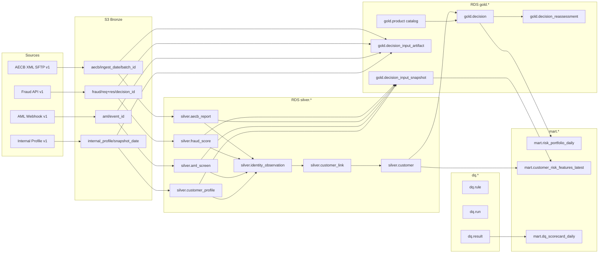

# Data Lineage

This doc answers two operational questions:

1. *If contract X changes, what breaks?*
2. *If table Y looks wrong, where does its data come from?*

It is published in two forms:

- A **human-readable diagram** (below) to orient reviewers and onboard new engineers.
- A **machine-readable manifest** (`lineage.yaml`, below) that a CI job uses to block PRs which change a source without also touching all of its known consumers.

---

## 1. Diagram (source → Silver → Gold → Mart)



Observations that fall out of the diagram:

- **Changing any of S1–S4** can impact `silver.*`, identity resolution, `gold.decision_input_snapshot`, and marts — the CI block is justified.
- **`silver.customer` is the keystone**: every mart and every Gold snapshot resolves through it. Its schema changes carry the highest blast radius.
- **`gold.decision_input_snapshot` is a sink** (append-only). No downstream table is allowed to rewrite it; marts derive from it read-only.

---

## 2. Machine-readable manifest (`lineage.yaml`)

Used by CI: when a source contract changes, CI checks that the PR touches every downstream artifact listed here, or the PR author explicitly waives each omission with a reason.

```yaml
# docs/lineage.yaml
version: 1
nodes:
  # ---- Sources / Bronze ----
  - id: source.aecb.v1
    contract: docs/data_contracts/aecb.md
    schema: python/mal_pipeline/schemas/aecb.v1.json
    bronze_prefix: bronze/aecb/
    owners: [data-engineering, credit-risk]

  - id: source.fraud.v1
    contract: docs/data_contracts/fraud.md
    schema_in:  python/mal_pipeline/schemas/fraud_request.v1.json
    schema_out: python/mal_pipeline/schemas/fraud_response.v1.json
    bronze_prefix: bronze/fraud/
    owners: [decisioning, data-engineering]

  - id: source.aml.v1
    contract: docs/data_contracts/aml.md
    schema: python/mal_pipeline/schemas/aml_webhook.v1.json
    bronze_prefix: bronze/aml/
    owners: [compliance, data-engineering]

  - id: source.internal_profile.v1
    contract: docs/data_contracts/internal_profile.md
    schema: python/mal_pipeline/schemas/internal_profile.v1.json
    bronze_prefix: bronze/internal_profile/
    owners: [customer-systems, data-engineering]

  # ---- Silver ----
  - id: silver.aecb_report
    from: [source.aecb.v1]
    ddl: sql/02_silver_schema.sql
    loader: python/mal_pipeline/ingest/aecb_xml.py

  - id: silver.fraud_score
    from: [source.fraud.v1]
    ddl: sql/02_silver_schema.sql
    loader: python/mal_pipeline/ingest/fraud_api.py

  - id: silver.aml_screen
    from: [source.aml.v1]
    ddl: sql/02_silver_schema.sql
    loader: python/mal_pipeline/ingest/aml_reconcile.py

  - id: silver.customer_profile
    from: [source.internal_profile.v1]
    ddl: sql/02_silver_schema.sql
    loader: python/mal_pipeline/ingest/internal_profile_extract.py

  - id: silver.identity_observation
    from:
      - silver.aecb_report
      - silver.fraud_score
      - silver.aml_screen
      - silver.customer_profile
    ddl: sql/02_silver_schema.sql
    loader: python/mal_pipeline/identity/resolve_customer_keys.py

  - id: silver.customer
    from: [silver.identity_observation]
    ddl: sql/02_silver_schema.sql
    loader: python/mal_pipeline/identity/resolve_customer_keys.py

  - id: silver.customer_link
    from: [silver.identity_observation, silver.customer]
    ddl: sql/02_silver_schema.sql
    loader: python/mal_pipeline/identity/resolve_customer_keys.py

  # ---- Gold ----
  - id: gold.decision
    from: [silver.customer, gold.product]
    ddl: [sql/03_gold_dq_marts.sql, sql/04_sharia_and_policy.sql]
    writer: decisioning-service

  - id: gold.decision_input_snapshot
    from:
      - silver.fraud_score
      - silver.aecb_report
      - silver.aml_screen
      - silver.customer_profile
      - silver.customer
      - dq.result
    ddl: sql/03_gold_dq_marts.sql
    contract: docs/data_contracts/decision_input_snapshot.md
    schema: python/mal_pipeline/schemas/decision_input_snapshot.v1.json
    writer: python/mal_pipeline/decision/snapshot_inputs.py

  - id: gold.decision_input_artifact
    from: [gold.decision_input_snapshot]
    ddl: sql/03_gold_dq_marts.sql

  - id: gold.decision_reassessment
    from: [gold.decision, silver.aecb_report]
    ddl: sql/04_sharia_and_policy.sql
    loader: dags/aecb_post_arrival_reassessment.py

  - id: gold.product
    ddl: sql/04_sharia_and_policy.sql
    writer: product-catalog-service

  # ---- DQ ----
  - id: dq.result
    from: [silver.*, gold.*]
    ddl: sql/03_gold_dq_marts.sql
    loader: python/mal_pipeline/dq/run_dq.py

  # ---- Marts ----
  - id: mart.risk_portfolio_daily
    from: [gold.decision, dq.result]
    ddl: sql/03_gold_dq_marts.sql
    loader: python/mal_pipeline/etl/build_marts.py

  - id: mart.customer_risk_features_latest
    from: [silver.customer, silver.fraud_score, silver.aecb_report, silver.aml_screen]
    ddl: sql/03_gold_dq_marts.sql

  - id: mart.dq_scorecard_daily
    from: [dq.result]
    ddl: sql/03_gold_dq_marts.sql
    loader: python/mal_pipeline/etl/build_marts.py
```

---

## 3. How the lineage is enforced

### CI gate (repo-level)

A lightweight CI job parses `docs/lineage.yaml` and, when a source contract changes, verifies that the PR touches every direct consumer listed under `from`. If not, it demands an explicit `lineage-waived:` line in the PR body with a short reason.

### Runtime lineage (optional, post-launch)

Each ingestion/transform writes **OpenLineage events** to a collector (Marquez or AWS Glue Lineage). That gives us runtime evidence that the static manifest is still accurate. We keep the static YAML as the source of truth; the runtime events are the audit trail.

### Field-level lineage

Table-level lineage above is enough for most change-management decisions. When a deeper question arises — e.g., “where does `mart.customer_risk_features_latest.feature_payload.fraud_score` come from?” — we answer with:

1. `lineage.yaml` gets us to the source table (`silver.fraud_score`).
2. The data contract (`docs/data_contracts/fraud.md`) names the exact field (`score`).
3. The JSON schema (`fraud_response.v1.json`) pins its shape and range.

That chain is enough to bound the blast radius without carrying a full column-level lineage graph.

---

## 4. Related files

- `docs/data_contracts/` — contracts per source + the snapshot.
- `python/mal_pipeline/schemas/` — machine-readable schemas.
- `python/mal_pipeline/dq/schema_validator.py` — used by ingest + DQ to enforce contracts.
- `sql/07_schema_registry.sql` — `audit.source_schema_version` registry.
